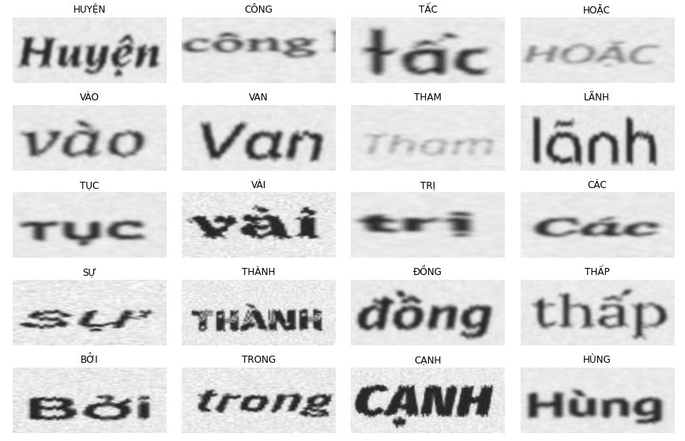
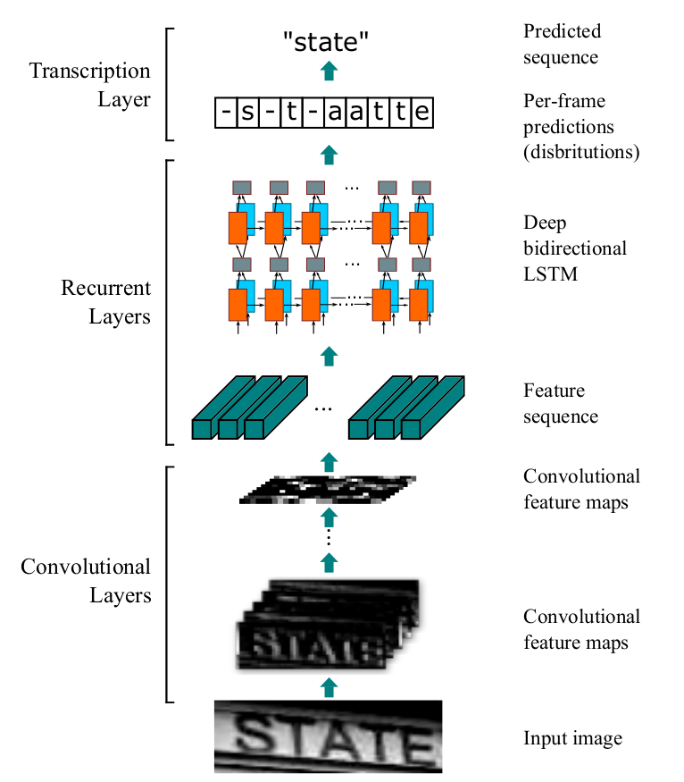

# Vietnamese OCR with CRNN

Text Recognition from images using CRNN for Vietnamese words.

## Install requirements

```
pip install -r requirements.txt
```
## Dataset

Dataset is used for project [here](https://drive.google.com/file/d/1dVO8yyqvyGVeWnQ78C5WYOdjCwaa7mUr/view?usp=sharing).
This dataset contains over 20.000 images of Vietnamese word.



## CRNN Model

Project used [Convolutional Recurrent Neural Network (CRNN)](https://arxiv.org/abs/1507.05717), a combination of CNN and RNN.
The architecture consists of three parts: 
1) convolutional layers, which extract a feature sequence from the input image;
2) recurrent layers, which predict a label distribution for each frame;
3) transcription layer, which translates the per-frame predictions into the final label sequence.

[][1]

## Prepare

Pretrained model for prediction and evaluation [vn_model.h5](https://drive.google.com/file/d/1-WmGlGVQtyrcPFCqwMYiwULKXvO_XM8M/view?usp=sharing)

Download dataset and pretrained model from Google Drive. Then, extract and
split dataset into train, validate and test set.

```
python prepare.py
```

## Run application

```
python main.py
```

Application run on <http://localhost:8096>

## Api

1. Training model
    - URL: /train
    - Method: GET
    - Params:
         - **epochs**: Number of training epochs, integer
    - Usage: Training model and save weights

2. Evaluation 
    - URL: /evaluate
    - Method: POST
    - Body:
        - **filename**: Path to file contain image's paths and labels
    - Usage: Evaluate accuracy and letter accuracy of model with data described in filename or (paths, labels).
    - Return: Accuracy, letter accuracy

3. Prediction
    - URL: /predict
    - Method: POST
    - Body:
        - **img**: Path to image for prediction
    - Usage: Predict text in new image
    - Return: Text predicted

[1]: <https://arxiv.org/abs/1507.05717> "An End-to-End Trainable Neural Network for Image-based Sequence
Recognition and Its Application to Scene Text Recognition"
